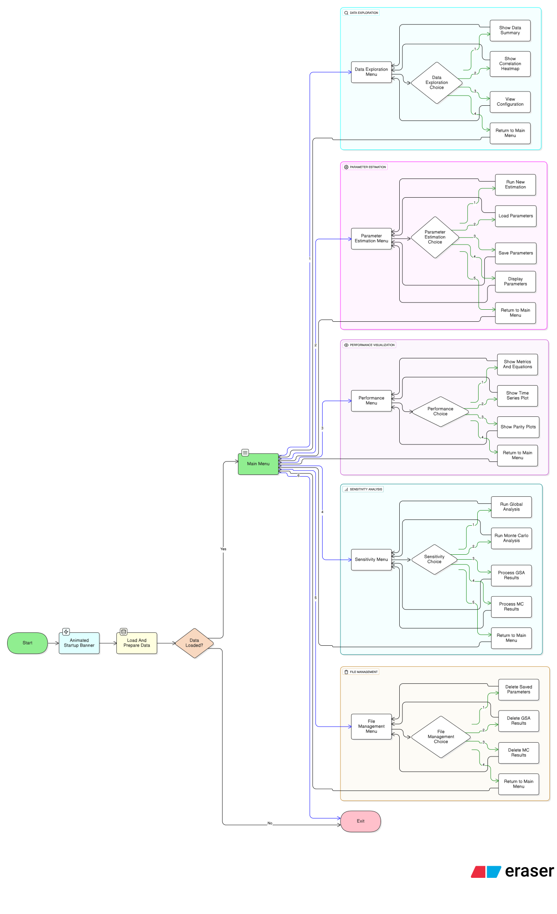

# KINEMOD-KIT Terminal Interface Project

<p align="center">
  
</p>

## A Fully integrated kinetic modelling kit for UASB-Filtration-RBC effluent Prediction

> **Author's Note:** This Python code serves as the core analytical engine for my thesis research, focusing on the data analysis and kinetic modeling of a combined reactor system for treating Palm Oil Mill Effluent (POME).

KINEMOD-KIT is a terminal-based toolkit designed to provide a powerful suite of tools to model, validate, and analyze data from a three-stage POME treatment reactor (UASB-Filtration-RBC).

## Why KINEMOD-KIT?

Wastewater treatment process data is often complex and noisy. Manual analysis using spreadsheets is time-consuming and prone to errors. KINEMOD-KIT was created to solve this by providing a structured and automated workflow, right from your terminal.

- A GUI-free, command-line interface (CLI) that allows for rapid analysis and iteration.  
- Every analysis follows the same logic, ensuring consistent and scientifically defensible results.
- Gives the user granular control over every aspect of the modeling and analysis process.

## ✨ Key Features

- **🔬 Segmented Modeling:** Each reactor stage (UASB, Filter, RBC) is modeled as a separate object for maximum modularity.
 
- **⚙️ Automated Parameter Calibration:** Uses non-linear optimization algorithms to find the best-fit kinetic parameters from your data.

- **📊 Complete Statistical Validation:** Automatically calculates R², RMSE, and ANOVA to evaluate model fit.

- **🚀 Dual Sensitivity Analysis:** Equipped with Sobol (GSA) and Monte Carlo simulation methods to identify the most influential parameters.

- **🖥️ Modern Terminal Interface:** Powered by `rich` for an interactive and visually appealing user experience.

- **🎨 Professional Visualization:** Generates publication-quality plots and heatmaps using `Seaborn`.

## Diagram of the workflow
<p align="center">
  
</p>

## How to use the KINEMOD-KIT CLI

### Installation

Ensure you have **Python 3.8** or newer installed

1. Clone this repository
```bash
git clone https://github.com/mursyidanbldn/kinemod-kit-cli.git
```

2. Navigate into the project directory
```bash
cd kinemod-kit-cli
```

3. Install all required libraries
```bash
pip install -r requirements.txt
```

### Usage
Make sure your data file [Model_Data.csv](./Model_Data.csv) is located inside the project folder. Then, run the application:
```bash
python run_analysis.py
```
The application will load the data and present you with an interactive main menu to begin your work.

## Tweak

If you want to edit or tweak this project, **CLONE IT**, you dum dum.

## Find a bug?

If you found a bug or something that bother you and want me to find out, please submit the issue using issues tab above.

## Known issues (Work in progress)

The sensitivity analysis is a bit wonky, the menu is confusing, might need some rework.

<p align="center"> Built with ❤️ and a lot of coffee by <b>Rizky Mursyidan Baldan</b> </p>
